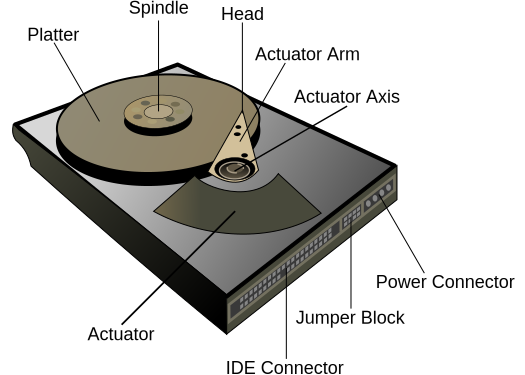
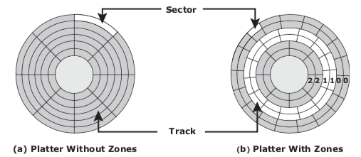

% Magnetic disks notes

Components
==========

-   Hard disk drives encased with controller board and power /
    data connectors.

-   1 or more aluminimum platters mounted on spindle separated by a
    small gap.

-   Spindle attached to motor spins platters at constant speed.
	(Usually 5400, 7200 or 10000 RPM)

-   Platters (2-sided) coated with magnetically susceptible material.

-   Heads mounted on an actuator arm, moves all heads simultaneously.

-   Heads are separated from the platter by a small air gap known as the
    “head flying height” which is maintained by a cushion of air.

    -   Before stopping the platter’s rotation, the heads are moved
        towards the “landing zone”.

    -   If the heads contact the disk otherwise it is known as a “head
        crash” and risks loss of data.

Geometry
========

Tracks:

:   concentric rings on each platter. Because of multiple platters, each
    with two sides, normally refer to cylinder and head to uniquely
    identify a track:

    Cylinder:

    :   identical set of tracks on both surfaces of all drive platters,
        numbered from zero at outer edge.

    Head:

    :   head identifies which platter and side that the track identified
        by the cylinder is located within.

Sector / block:

:   subdivisions of tracks, each numbered from 1.

Logical block addressing
========================

In order to be able to locate our data, we need a way to address
sectors:

Cylinder-Head-Sector (CHS)

:   is a 3-part addressing scheme, where the head identifies the platter
    and side, the cylinder picks the track and the sector is with
    reference to the track. Host needs to be aware of disk geometry:

Logical Block Addressing (LBA)

:   is a simple linear addressing scheme, where the drive controller
    translates the linear address starting from zero to the 3-part
    C-H-S address.

Address in CHS and LBA format are internally binary numbers and often
appear on real systems in hex form. However, they can be understood and
manipulated as integers for familiarisation purposes.

Converting CHS to LBA
---------------------

The logical block address (LBA) for a given $C, H, S$ tuple
corresponding to the cylinder, head and sector is given by the formula:

	LBA = ( C * HPC + H ) * SPT + ( S - 1 )

where

-   HPC is the number of heads per cylinder

-   SPT is the number of sectors per track

Converting LBA to CHS
---------------------

The LBA to CHS operation requires three different formulas:

	C = LBA / ( HPC * SPT )
	H = ( LBA / SPT ) % HPC
	S = ( LBA % SPT ) + 1

Noting that:

-   The `/` symbol means integer division where any fractional
    remainder is truncated (NOT rounded)

-   The `%` symbol means modulo, i.e. the remainder.

As a sanity check, remember also that H must be less than the number
of heads per cylinder and that S must be less than or equal to the
number of sectors per track:

	H < HPC 
	S <= SPT

Zoned bit recording
===================

Zoned bit recording increases the storage capacity of the disks by
accounting for the varying density of sectors from the spindle to the
edge:

-   Cylinders are grouped into zones based on their distance from
    the spindle.

-   The zones are numbered (like cylinders) from zero at the disk edge.

-   Suitable number of sectors per cylinder assigned within each zone.

Capacity
========

Disk capacity is normally expressed in bytes, or suitable multiples like
or . A confusing situation exists regarding actual vs advertised
capacity.

-   Normally when dealing with binary units like bits and bytes, we use
    binary prefixes, taking the multiplier to be 1024.

-   Drive manufacturers however like to use a decimal prefixes
    (multiplier of 1000) when advertising, since it leads to higher
    numbers for the same disk capacity.

Converting from advertised to actual capacity
---------------------------------------------

To convert from advertised capacity to actual capacity:

1.  Re-write the advertised capacity in bytes by multiplying
    successively by 1000 to remove the decimal prefix,
    leaving the answer in bytes.

2.  Successively divide the capacity in bytes by 1024 to re-write using
    binary prefixes

We could try to write this as a formula:

	actual = ( advertised * 1000^x ) / 1024^x

where `x` depends on the units in question:

	kB =>  x = 1
	MB =>  x = 2
	GB =>  x = 3
	TB =>  x = 4
	PB =>  x = 5

Converting from actual to advertised capacity
---------------------------------------------

To convert from actual capacity to advertised capacity:

1.  Re-write the actual capacity in bytes by multiplying successively by
    1024 to remove the binary prefix, leaving the answer in bytes.

2.  Successively divide the capacity in bytes by 1000 to re-write using
    decimal prefixes.

This process can also be written as a formula:

	advertised = actual * 1024^x / 1000^x

where $x$ depends on the units in question as above.

Disk service time
=================

The disk service time, TS is the time taken by a disk to complete an
I/O request, composed of:

1. the seek time, T
2. average rotational latency, L
3. data transfer time, X

where:

	TS = T + L + X

Seek / access time
------------------

Seek time is the time required to position the head on the correct
track. Obviously this isn’t uniform, so seek time is given separately:

Full stroke:

:   time taken to move from innermost to outermost track.

Track-to-track:

:   time taken to move between adjacent tracks.

Average:

:   time taken to move head from one random track to another.

We are normally concerned with the average seek time, defined as
one-third of the full stroke:

	average seek time = full-stroke seek time / 3
	full-stroke seek time = full-stroke seek time * 3
	
Typical average seek times would range from .

Example: Calculate the full-stroke seek time for a drive given an average seek time of 6ms.

	full-stroke seek time = 6 ms * 3
	                      = 18ms

Rotational latency
------------------

The average rotational latency, L, is the time taken for the drive to
revolve half a revolution:

	L = 0.5 / revolutions per second

This measure depends on drive speed, we must convert RPM to
revolutions per second.

Example: Rotational latency: Determine the average rotational latency for a 5400-rpm drive:

	5400 RPM = 5400 / 60 RPs
		     = 90 RPs
           L = 0.5 / 90 
             = 5.5 ms

Internal transfer time (X)
--------------------------

The data transfer time is how long it takes for one block of data (at a
given size) to be transferred inside the drive.

	X = block size / internal transfer rate

Example: Internal transfer time
Determine the transfer time given an internal transfer rate of and a
block size of .

    X = 32kB / 40 MB/s
      = ( 32 * 1024 ) / ( 40 * 1024 * 1024 )
      = 0.78 ms

IOPS
----

Storage performance is commonly quantified in Input/Output operations
Per Second (or IOPS), which is the reciprocal of the disk service time, TS.

	IOPS = 1.0 / TS

Native command queueing
=======================

A hard disk receives multiple commands in quick succession. Each command
will be delayed by seek time and rotational latency.

SATA Native Command Queueing tries to optimise the overall latency by
re-ordering the commands to reduce these latencies, .

All NCQ algorithms will optimise the seek time, but some will also
optimise the rotational latency.
